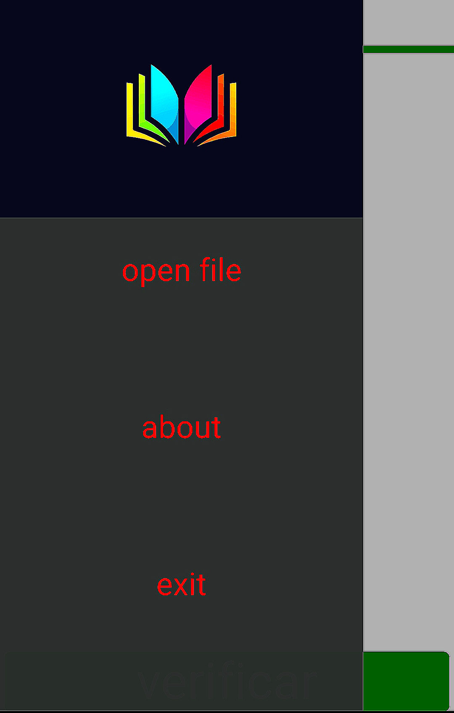
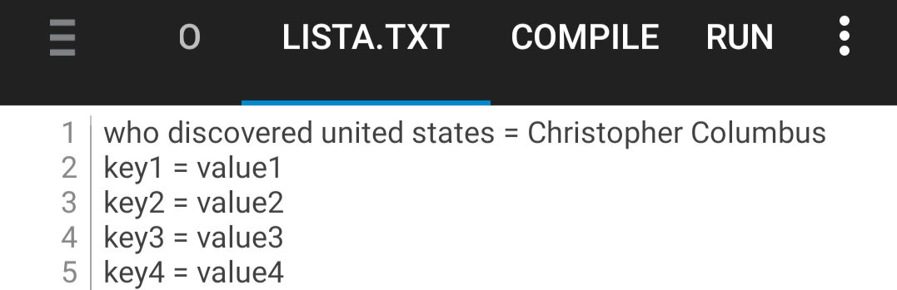
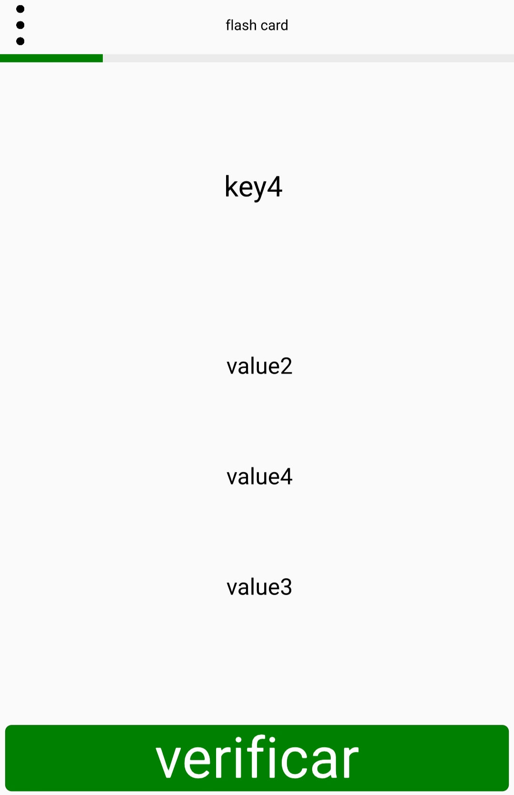

# flash card
 
Android flash card app. 
That's a app used in case you have a list to remember. 
 
<h1>click on open file
 

 
file should be in format: 

 
question and answers:
 

 
When you completed the list:

 
</h1>
